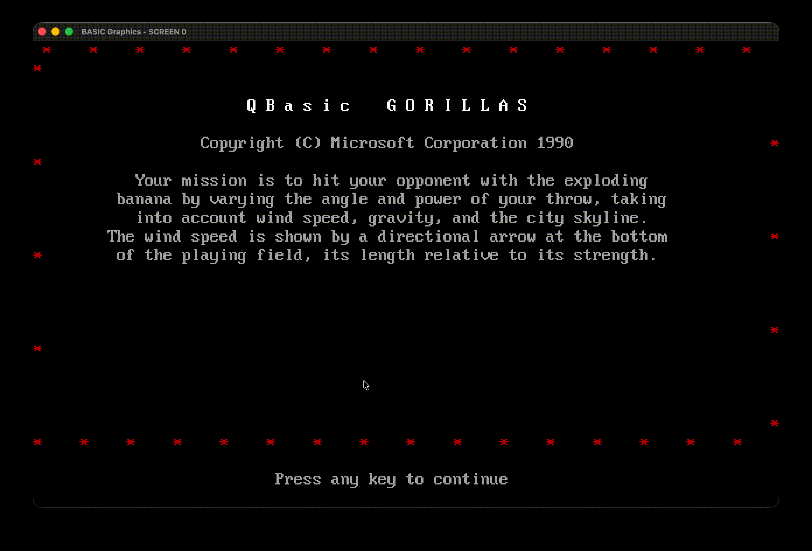

# go-basic

A Turbo BASIC / QBasic to Go transpiler. Compiles classic `.bas` files into standalone Go programs.

```basic
10 PRINT "HELLO WORLD"
20 FOR I = 1 TO 5
30   PRINT "COUNT:"; I
40 NEXT I
50 END
```

becomes:

```go
package main

import "fmt"

func main() {
    fmt.Println("HELLO WORLD")
    var I float32
    for I = float32(1); I <= float32(5); I += float32(1) {
        fmt.Print("COUNT:", I)
        fmt.Println()
    }
}
```

## In Action

The classic QBasic Gorillas game, compiled from the original `.bas` source and running as a native Go binary:



## Features

- Full Turbo BASIC / QBasic parser — handles real-world programs including the classic QBasic Gorillas game
- Go source code output — generates standalone, compilable `.go` files
- Graphics runtime — SCREEN modes, sprites (GET/PUT), CIRCLE, LINE, PAINT, DRAW, PALETTE
- Audio support — SOUND and PLAY commands
- Bytecode VM — alternative backend that interprets programs directly
- Runtime library — Go implementations of BASIC builtins (`LEFT$`, `MID$`, `SIN`, `PRINT USING`, etc.)
- Educational codebase — extensively commented to explain how compilers work

### Language Support

| Category | Supported |
|----------|-----------|
| Control flow | `IF/THEN/ELSE/ELSEIF`, `FOR/NEXT`, `WHILE/WEND`, `DO/LOOP`, `SELECT CASE`, `GOTO`, `GOSUB/RETURN` |
| Procedures | `SUB`, `FUNCTION`, `DEF FN`, `DECLARE`, `CALL` |
| Variables | Integer (`%`), Long (`&`), Single (`!`), Double (`#`), String (`$`) |
| Arrays | `DIM`, `REDIM`, `ERASE`, multi-dimensional |
| Data | `DATA`, `READ`, `RESTORE` |
| I/O | `PRINT`, `INPUT`, `LINE INPUT`, `PRINT USING`, `WRITE` |
| File I/O | `OPEN`, `CLOSE`, `PRINT#`, `INPUT#`, `WRITE#`, sequential/random/binary |
| String functions | `LEFT$`, `RIGHT$`, `MID$`, `CHR$`, `ASC`, `STR$`, `VAL`, `INSTR`, `UCASE$`, `LCASE$`, `LTRIM$`, `RTRIM$`, `HEX$`, `OCT$`, `BIN$`, `STRING$`, `SPACE$` |
| Math functions | `ABS`, `SGN`, `INT`, `FIX`, `SQR`, `SIN`, `COS`, `TAN`, `ATN`, `EXP`, `LOG`, `RND`, `CINT`, `CLNG`, `CSNG`, `CDBL` |
| User types | `TYPE...END TYPE` with field access |
| Graphics | `SCREEN`, `CIRCLE`, `LINE`, `PSET`, `PRESET`, `PAINT`, `DRAW`, `GET`, `PUT`, `PALETTE`, `COLOR`, `VIEW`, `WINDOW`, `CLS` |
| Sound | `SOUND`, `PLAY` |
| Turbo BASIC extensions | `DO/LOOP`, `EXIT`, `SELECT CASE`, `INCR/DECR`, `$DYNAMIC`, `$IF/$ENDIF` |

## Quick Start

### Prerequisites

- [Go 1.24+](https://go.dev/dl/)

#### Platform Dependencies

The graphics and audio runtime uses [Ebiten](https://ebitengine.org/) and [Oto](https://github.com/ebitengine/oto). On most systems these work out of the box, but Linux requires a few system packages:

**macOS** — No extra dependencies needed.

**Windows** — No extra dependencies needed.

**Linux (Debian/Ubuntu)**:
```bash
sudo apt-get install libc6-dev libgl1-mesa-dev libxcursor-dev libxi-dev libxinerama-dev libxrandr-dev libxxf86vm-dev libasound2-dev pkg-config
```

**Linux (Fedora)**:
```bash
sudo dnf install mesa-libGL-devel libXcursor-devel libXi-devel libXinerama-devel libXrandr-devel libXxf86vm-devel alsa-lib-devel pkg-config
```

### Build

```bash
git clone https://github.com/loabletech/go-basic.git
cd go-basic
go build -o go-basic .
```

### Run Tests

```bash
go test ./...
```

## Usage

```
go-basic transpile <file.bas>                Transpile to Go source (stdout)
go-basic transpile <file.bas> -o <file.go>   Transpile and write to a file
go-basic compile <file.bas>                  Compile to executable binary
go-basic compile <file.bas> -o <output>      Compile with custom output name
go-basic help                                Show detailed help
```

### Commands

#### `compile` — Compile a BASIC program to a native binary

Transpiles the `.bas` file to Go and builds it into a standalone executable in one step. The output binary name defaults to the input filename without the extension.

```bash
# Compile gorilla.bas → ./gorilla
./go-basic compile examples/gorilla.bas

# Compile with a custom output name
./go-basic compile examples/gorilla.bas -o mygame

# Run the compiled program
./gorilla
```

#### `transpile` — Transpile to Go source code

Generates Go source code from a BASIC program. Useful for inspecting the generated code, making manual edits, or integrating into a larger Go project.

```bash
# Print generated Go source to stdout
./go-basic transpile examples/gorilla.bas

# Write to a file
./go-basic transpile examples/gorilla.bas -o gorilla.go

# Redirect to a file
./go-basic transpile examples/gorilla.bas > gorilla.go
```

#### `help` — Show detailed help

Displays the full help including all supported BASIC features, screen modes, and examples.

```bash
./go-basic help
```

### Supported Screen Modes

| Mode | Resolution | Colors | Hardware Origin |
|------|-----------|--------|-----------------|
| SCREEN 0 | Text 80x25 | 16 | Text mode |
| SCREEN 1 | 320x200 | 4 | CGA |
| SCREEN 2 | 640x200 | 2 | CGA |
| SCREEN 7 | 320x200 | 16 | EGA |
| SCREEN 9 | 640x350 | 16 | EGA |
| SCREEN 12 | 640x480 | 16 | VGA |
| SCREEN 13 | 320x200 | 256 | VGA/MCGA |

### Manual Build Workflow

If you prefer to transpile and build separately (e.g., to customize the Go code before compiling):

```bash
mkdir myproject && cd myproject
go mod init myapp
../go-basic transpile ../examples/gorilla.bas -o main.go
go mod edit -require github.com/loabletech/go-basic@latest
go build -o myapp .
./myapp
```

## How It Works

The compiler follows a classical multi-stage pipeline:

```
Source (.bas)  →  Lexer  →  Parser  →  Semantic Analysis  →  Code Generator  →  Output (.go)
```

**Lexer** (`internal/lexer/`) — Hand-written scanner. Converts source text into a stream of typed tokens. Handles BASIC keywords, type suffixes (`%`, `&`, `!`, `#`, `$`), string literals, numbers (decimal, hex `&H`, octal `&O`), and line structure.

**Parser** (`internal/parser/`) — Recursive descent for statements, Pratt parsing (TDOP) for expressions. Resolves the ambiguity between function calls, array accesses, and variable references. Produces a typed AST.

**AST** (`internal/ast/`) — Abstract syntax tree with Statement and Expression node types. Later phases walk the tree using Go type-switches (visitor pattern without the boilerplate).

**Semantic Analysis** (`internal/semantic/`) — Builds a symbol table with inferred types from variable suffixes, `DIM` declarations, and assignment context.

**Code Generator** (`internal/codegen/`) — Tree-walking transpiler that emits Go source code. Maps BASIC constructs to Go equivalents. Uses a runtime library for BASIC-specific features.

**Runtime** (`internal/runtime/`) — Pure Go implementations of BASIC builtins: math functions, string operations, file I/O, formatted output, and system functions.

**Bytecode VM** (`internal/vm/`) — Alternative backend. Compiles AST to stack-based bytecode and interprets it directly.

## Project Structure

```
main.go               CLI entry point (transpile / compile)
internal/
  lexer/              Tokenizer
  parser/             Recursive descent + Pratt parser
  ast/                AST node definitions
  semantic/           Type inference and symbol table
  codegen/            Go code generator (transpiler)
  vm/                 Bytecode compiler and interpreter
  runtime/            BASIC runtime library
    math.go           ABS, SIN, SQR, RND, etc.
    strings.go        LEFT$, MID$, CHR$, STR$, etc.
    io.go             PRINT helpers, formatting
    fileio.go         File I/O (OPEN, CLOSE, PRINT#, etc.)
    graphics.go       SCREEN, PSET, LINE, CIRCLE, PAINT, GET/PUT, etc.
    system.go         TIMER, DATE$, ENVIRON$, etc.
    errors.go         ON ERROR / RESUME support
  integration/        End-to-end tests
  benchmark/          Performance benchmarks
examples/             BASIC source programs and generated Go output
docs/                 Documentation
images/               Screenshots and demos
```

## Current Status

| Metric | Count |
|--------|-------|
| Example programs | 65 (all parse successfully) |
| Generated Go files that compile | 64 / 65 |
| Test packages passing | 10 / 10 |
| Parser regression tests | 24 |

## Examples

The `examples/` directory contains BASIC programs covering everything from hello world to the QBasic Gorillas game.

```bash
# Try these
./go-basic compile examples/gorilla.bas
./go-basic compile examples/circle_draw.bas
./go-basic compile examples/fibonacci.bas
```

## Contributing

Contributions are welcome. The codebase is extensively commented to explain compiler concepts. Start with `internal/lexer/token.go` and follow the pipeline.

## Learning Compiler Design

This project was built to be readable. Every major file includes comments explaining the compiler concepts it implements:

- **Lexical analysis** — `internal/lexer/lexer.go` explains scanning, tokens, and keywords
- **Parsing** — `internal/parser/parser.go` covers recursive descent, Pratt parsing, and precedence
- **AST design** — `internal/ast/ast.go` explains node hierarchies and the visitor pattern
- **Code generation** — `internal/codegen/codegen.go` walks through tree-walking transpilation
- **Virtual machines** — `internal/vm/` demonstrates bytecode compilation and stack-based execution

## License

MIT

## Acknowledgments

Inspired by Borland Turbo BASIC (1987) and Microsoft QBasic (1991). Built for anyone who remembers the joy of `RUN`.
